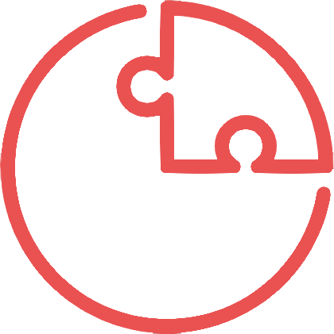

<div align="center">
  <a href="https://v2.nonebot.dev/store"></a>
</div>
<div align="center">
    ✨ 痒痒鼠们自己的机器人 ✨<br/>
    🧬 支持AI、消息推送等多种使用功能 ⚙️<br/>
    🎆 如果喜欢请点个⭐吧！您的支持就是我持续更新的动力 🎉<br/>
</div>

## 🎁 安装命令

> 安装完成后执行以下命令进行部分的库的安装以及升降级
>
> 部分插件的安装步骤和使用请参考插件原文档

```
nb plugin install nonebot-plugin-autoreply nonebot-bison nonebot-plugin-send-anything-anywhere nonebot-plugin-naturel-gpt  nonebot_plugin_memes 
.vnev/bin/pip3 install httpx[socks] requests[socks]
.vnev/bin/pip3 pip install --force-reinstall 'pydantic~=1.10' #降级
.vnev/bin/pip3 pip install --upgrade 'openai>=1.0' #升级
.vnev/bin/pip3 pip install requests pillow
```

> 附带的咸鱼之王插件需配置中添加`xyzwhelp_apikey`在ocr.space自行申请，如果使用其他api自行 修改`utils/get.py`文件中的`ocr_space_file`函数
>

## 💡 功能列表

> 以下未勾选功能仅表示未来可能开发的方向，不代表实际规划进度，具体开发事项可能随时变动
> 勾选: 已实现功能；未勾选: 正在开发 / 计划开发 / 待定设计

- [ ] 消息推送

## 📄 使用文档

尚在制作中~

## 🎢 更新日志

<details>
<summary>点击展开</summary>

### [2024/6/28] v1.0.0 机器人发布

- 完善项目说明

</details>
